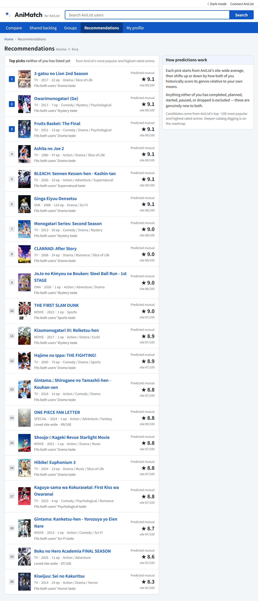

<h1>
  <picture>
    <source media="(prefers-color-scheme: dark)" srcset="docs/brand/lockup-dark.svg">
    
  </picture>
</h1>

**Find out if you and a friend actually share taste in anime.** Enter two AniList usernames.
AniMatch scores how compatible your taste is, shows where you disagree, and picks what to watch
together.

Comparing taste on AniList usually means opening two profiles side by side and scrolling. Which
shows did you both finish? Does your 7 mean the same as their 9? What's on both of your
plan-to-watch lists? AniMatch reads both public lists and answers all three on one page. It also
works for a whole group of friends.

> **Status:** live at [animatch-moe.vercel.app](https://animatch-moe.vercel.app). Compare,
> shared backlog, groups and recommendations all run on real AniList data. Next is a session
> planner for shared backlogs. See [ROADMAP.md](ROADMAP.md).

<picture>
  <source media="(prefers-color-scheme: dark)" srcset="docs/screenshots/compare-dark.png">
  
</picture>

## Try it

Open [animatch-moe.vercel.app](https://animatch-moe.vercel.app) and enter two usernames. Any
public AniList profile works, and you don't need an account. For a sample, see
[Anime × Kira](https://animatch-moe.vercel.app/compare?a=Anime&b=Kira).

## How it works

```text
animatch-moe.vercel.app/compare?a=Anime&b=Kira

Anime × Kira · 39/100 · Some common ground

                    value  weight
score correlation    0.10     45%   Pearson r on the 64 titles both scored
genre overlap         96%     30%   cosine similarity of their genre mix
completed overlap     14%     15%   65 of 474 completed titles are shared
studio affinity       40%     10%   studios both rate highly
```

The score is the weighted sum: 0.45 × 10 + 0.30 × 96 + 0.15 × 14 + 0.10 × 40 = 39. Agreeing on
scores counts most. Two people who watch the same genres but rate them differently still score
low, so this pair lands at 39 despite 96% genre overlap. Every comparison has its own link, so you
can send it to the other person.

## What it does

- **Scores** any two AniList users from 0 to 100, with the breakdown above.
- **Finds** your biggest disagreements: the titles you two scored furthest apart.
- **Compares** score distributions and genre taste side by side, as bars or a radar chart.
- **Recommends** popular, highly rated titles neither of you has listed, ranked by how much you
  would both enjoy them, with a reason for each pick.
- **Merges** your plan-to-watch lists into a shared backlog, ranked by predicted mutual score.
- **Groups** friends: stats for each member, a taste-match grid for every pair, and the backlog
  the whole group shares. Save a group under a name to reopen it later.
- **Shares** a comparison as an image card, ready to paste into a chat or save.
- **Signs in** with AniList (optional) so your own profile fills in automatically.
- **Fits** phones and follows your system's dark mode.

| Shared backlog | Groups |
| --- | --- |
|  |  |

| Recommendations | Mobile |
| --- | --- |
|  |  |

## Your lists stay yours

- **No AniMatch server.** The site is static files. Your browser loads lists straight from
  AniList's public API.
- **Read-only.** AniMatch never changes anything on your AniList account.
- **Kept in your browser.** Recent comparisons, saved groups and the optional sign-in token are
  stored in your browser only. The token is sent only to AniList.
- **No analytics** and no tracking.
- **Open source**, so you can check all of this.

## Development

You need Node 24.

```sh
npm install
npm start                   # dev server on http://localhost:4200
npm test                    # unit tests (Vitest)
npm run e2e                 # end-to-end tests (Playwright, starts its own server)
npm run build               # production build to dist/
node scripts/screenshots.mjs  # regenerate docs/screenshots (needs npm start -- --port 4213)
```

It's an Angular 22 app. It uses standalone components and signals, and gets its data from the
AniList GraphQL API. The UI is built on the Hikari design system, whose CSS tokens live in
`src/styles/tokens/` and components in `src/app/ui/`. CI runs the build and both test suites on
pushes to `main` and on pull requests. Vercel deploys `main`, and `vercel.json` handles the SPA
rewrites.

The logo and lockups are in [docs/brand](docs/brand).

### Your own AniList client

Signing in needs a registered AniList API client. The live site has one. For a fork, register
your own at [anilist.co/settings/developer](https://anilist.co/settings/developer) with the
redirect URL `https://<your-domain>/auth/callback`. Then set `ANILIST_CLIENT_ID` in
`src/app/anilist.config.ts`. The client ID is public by design, because the implicit grant flow
uses no secret.

## Contributing

Issues and pull requests are welcome. The next unchecked item in [ROADMAP.md](ROADMAP.md) is
what's being built.

## License

[MIT](LICENSE)
