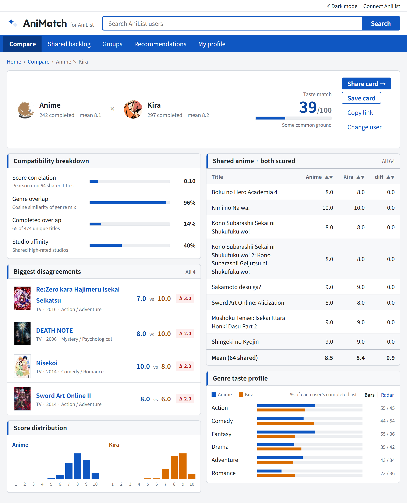
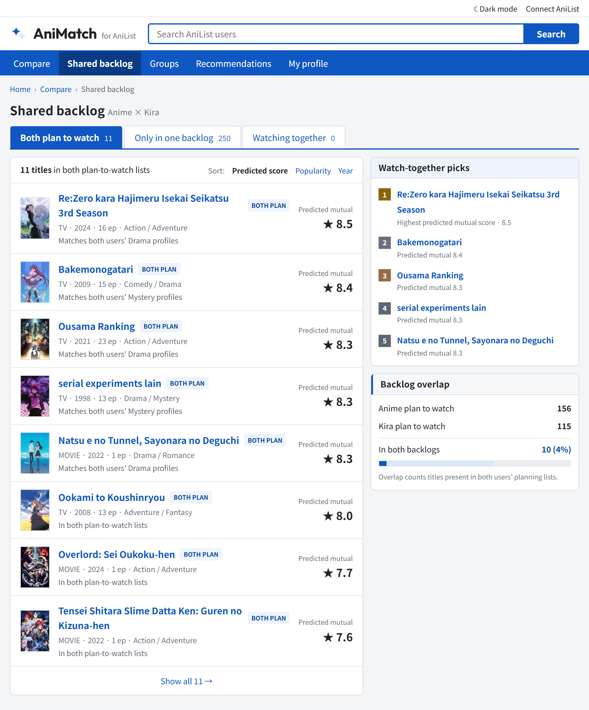
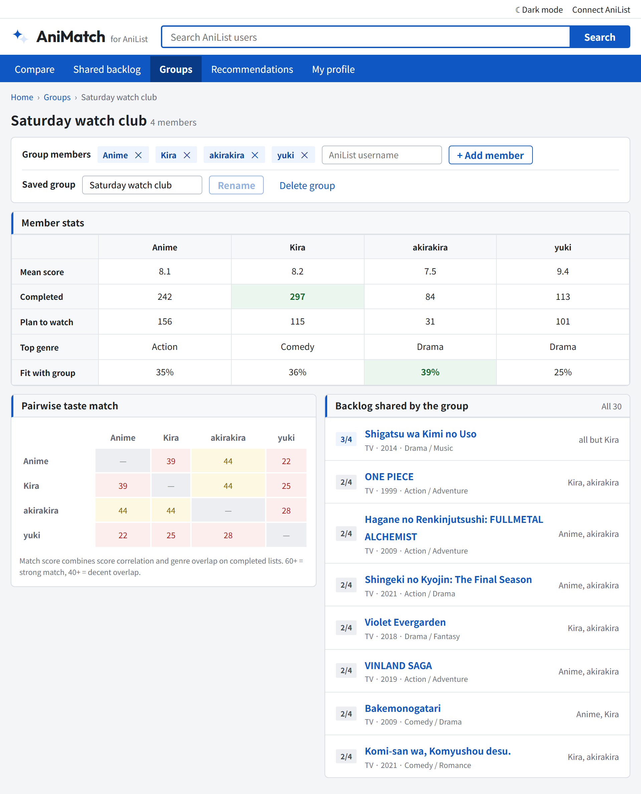
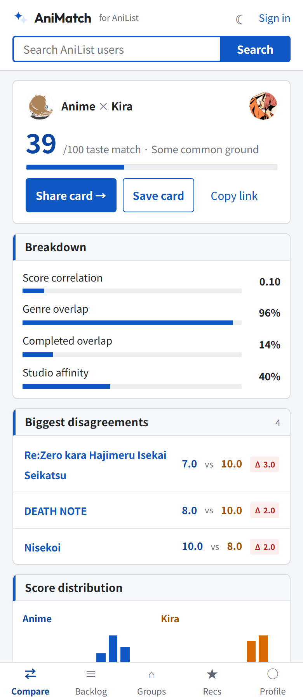

<h1 align="center">AniMatch</h1>

Compare anime taste between [AniList](https://anilist.co) users. One place that answers: **how compatible are we, where do we disagree, and what should we watch together?**



## ✨ Features

- ⚖️ **Head-to-head compare** — a 0–100 taste match score broken down into score correlation, genre overlap, completed overlap, and studio affinity.
- 💥 **Biggest disagreements** — the titles you two scored furthest apart, with per-user scores and delta badges.
- 📊 **Score distributions & genre profiles** — side-by-side histograms and per-genre bars for both users.
- 📚 **Shared backlog** — titles in both plan-to-watch lists, ranked by predicted mutual score, with watch-together picks.
- 👥 **Groups** — member stats, a pairwise taste-match heat matrix, and the backlog shared by the whole group.
- 📱 **Mobile layout** — compact summary view with bottom navigation under 720px.
- 🪪 **Profiles & sign-in** — view any public profile's stats (score distribution, genre taste, top studios), or connect your own AniList account via OAuth. Recent comparisons and groups persist locally.

| Shared backlog | Groups | Mobile |
| --- | --- | --- |
|  |  |  |

## 🛠️ Stack

- **Angular 22** — standalone components, signals, typed routes.
- **Hikari design system** — an information-dense, portal-style design language ported as CSS tokens (`src/styles/tokens/`) and reusable components (`src/app/ui/`).
- **AniList GraphQL** — public API, no auth: full lists (completed, planning, watching), user search, avatars, and cover art. Compare via `/compare?a=<user>&b=<user>`, groups via `/groups?users=<a,b,c>`; the design mockup's data shows as a demo until real users are loaded. See [ROADMAP.md](ROADMAP.md) for what's next.

## 🚀 Getting started

```bash
npm install
npm start        # dev server on http://localhost:4200
npm run build    # production build to dist/
npm test         # unit tests (vitest)
npm run e2e      # end-to-end tests (playwright, starts its own dev server)
```

## ☁️ Deploy

Built for [Vercel](https://vercel.com) — import the repo at vercel.com/new and the included `vercel.json` handles the SPA rewrites and output directory. CI (build + unit + e2e) runs on every push via GitHub Actions.

To enable "Connect AniList" on a deployment: register an API client at [anilist.co/settings/developer](https://anilist.co/settings/developer) with redirect URL `https://<your-domain>/auth/callback`, then paste the client ID into the one-time setup on the profile page (or set it as the default in `src/app/api/auth.service.ts`).
